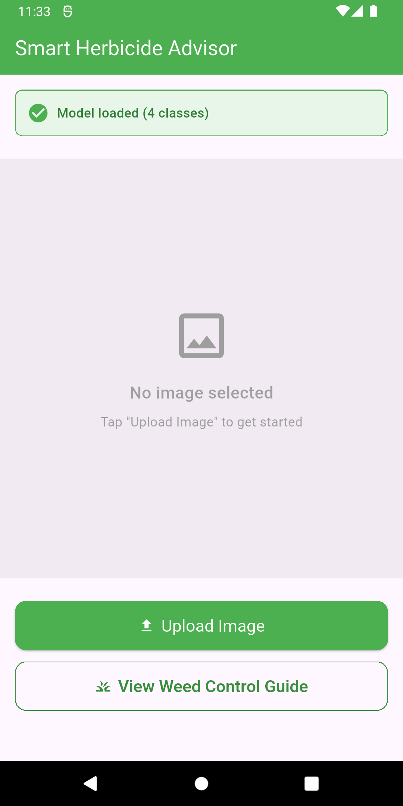
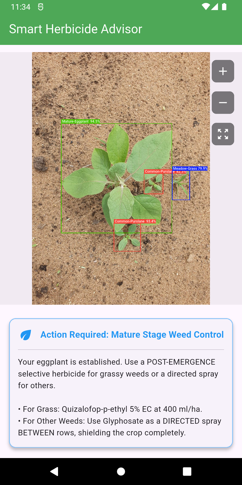
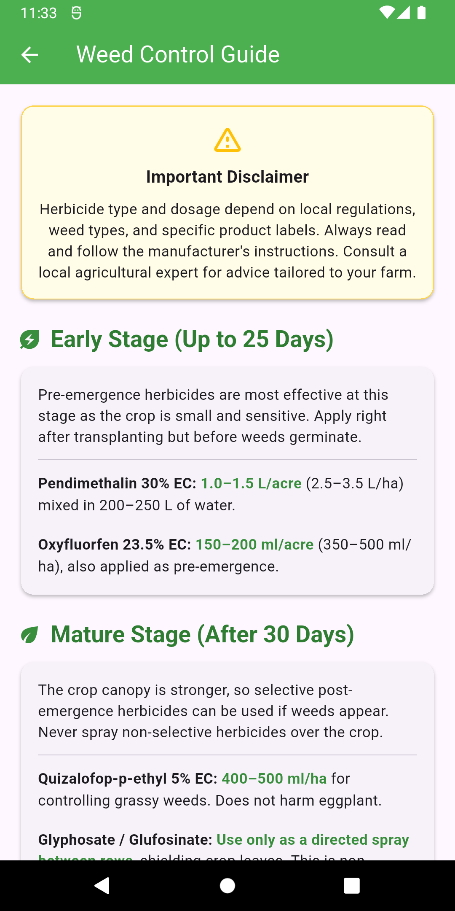

# CropGuard - Smart Herbicide Advisor 🌱


A Flutter-based mobile application that uses AI/ML to provide smart herbicide recommendations for crops. CropGuard helps farmers make informed decisions about crop protection using computer vision and machine learning.

## 📱 App Screenshots

<div align="center">
  
  
  
</div>

## ✨ Features

- 🤖 **AI-Powered Analysis**: Uses TensorFlow Lite for real-time crop disease detection
- 📷 **Camera & Gallery Integration**: Capture or upload photos of crops for instant analysis
- 💡 **Smart Recommendations**: Get personalized herbicide suggestions
- 🌐 **Offline Support**: Works without internet connection
- 🎨 **Modern UI**: Clean and intuitive user interface

## 🛠️ Prerequisites

Before running this app, make sure you have:

- **Flutter SDK** (3.0 or higher)
- **Dart SDK** (3.0 or higher)  
- **Android Studio** (for device deployment)
- **Git** for version control

### Check Flutter Installation:
```bash
flutter doctor
```

## 📋 Setup Instructions

### 1. Clone the Repository
```bash
git clone https://github.com/FahhaMohamed/Smart-Herbicide-Advisor.git
cd cropguard-app
```

### 2. Install Dependencies
```bash
flutter pub get
```

### 3. **IMPORTANT: Add Required Model Files**

⚠️ **The AI model files are not included in the repository due to size constraints.**

You need to manually add these files to make the app work:

#### Required Files:
```
assets/models/
├── best_float32.tflite    # AI model file (not in git)
└── labels.txt             # Labels file (not in git)
```

#### How to add them:

**Option A: Download from shared drive/source**
1. Get the model files from your project lead/shared drive
2. Create the `assets/models/` directory if it doesn't exist
3. Copy both files to the correct location

**Option B: Create the directory structure**
```bash
mkdir -p assets/models
# Then add your .tflite and labels.txt files here
```

#### File Structure Should Look Like:
```
your_project/
├── assets/
│   ├── models/
│   │   ├── best_float32.tflite  ← Add this file
│   │   └── labels.txt           ← Add this file
│   └── images/
├── lib/
├── pubspec.yaml
└── README.md
```

### 4. Update pubspec.yaml (if needed)
Make sure your `pubspec.yaml` includes:

```yaml
flutter:
  assets:
    - assets/models/
    - assets/images/
```

### 5. Run the App

#### For Android:
```bash
flutter run
```

#### For specific device:
```bash
# List available devices
flutter devices

# Run on specific device
flutter run -d [device-id]
```

## 🔧 Build Instructions

### Debug Build
```bash
flutter build apk --debug
```

### Release Build
```bash
# Android APK
flutter build apk --release

# Android Bundle (for Play Store)
flutter build appbundle --release
```

## 📁 Project Structure

```
lib/
├── core/
│   ├── constants/
│   │   ├── app_colors.dart
│   │   └── app_strings.dart
│   ├── theme/
│   │   └── app_theme.dart
│   ├── utils/
│   │   ├── box_painter.dart
│   │   └── color_finder.dart
│   ├── widgets/
│   │   ├── custom_icon_widget.dart
│   │   └── custom_snack.dart
│   ├── models/
│   │   └── detection_results.dart
│   ├── services/
│   │   └── recommendation_service.dart
│   ├── views/
│   │   ├── herbicide_guide_page/
│   │   │   └── herbicide_guide_page.dart
│   │   ├── image_upload_screen/
│   │   │   └── image_upload_screen.dart
│   │   └── splash_screen/
│   │       └── splash_screen.dart
│   └── main.dart
```

## 🚨 Troubleshooting

### Common Issues:

#### 1. **"Model file not found" error**
```
Error: Unable to load model from assets/models/best_float32.tflite
```
**Solution:** 
- Check that files exist in `assets/models/` directory
- Verify `pubspec.yaml` includes the assets path
- Make sure file names match exactly what's in `app_strings.dart`:
  - `best_float32.tflite` 
  - `labels.txt`

#### 2. **Flutter pub get fails**
```bash
# Clean and retry
flutter clean
flutter pub get
```

#### 3. **Build fails on Android**
```bash
# Check Android SDK
flutter doctor

# Clean build
flutter clean
cd android && ./gradlew clean && cd ..
flutter build apk
```

#### 4. **Camera permission issues**
Add these permissions to `android/app/src/main/AndroidManifest.xml`:
```xml
<uses-permission android:name="android.permission.CAMERA" />
<uses-permission android:name="android.permission.WRITE_EXTERNAL_STORAGE" />
```

## 📱 Supported Platforms

- ✅ **Android** (API 21+)

## 🧪 Testing

### Run Tests
```bash
# Unit tests
flutter test

# Integration tests
flutter test integration_test/
```

### Test Coverage
```bash
flutter test --coverage
genhtml coverage/lcov.info -o coverage/html
```

## 📦 Dependencies

### Main Dependencies:
- `flutter`: SDK
- `tflite_flutter`: TensorFlow Lite integration
- `camera`: Camera functionality
- `image_picker`: Image selection
- `path_provider`: File system access

### Dev Dependencies:
- `flutter_test`: Testing framework
- `flutter_lints`: Code linting

## 🔐 Environment Setup

### Model Files (.gitignore)
The following files are ignored in git due to size/sensitivity:
- `assets/models/best_float32.tflite`
- `assets/models/labels.txt`

**New team members:** Ask your project lead for these files!

## 👥 Contributing

1. Fork the repository
2. Create a feature branch (`git checkout -b feature/amazing-feature`)
3. Add the required model files
4. Run `flutter pub get`
5. Test your changes (`flutter test`)
6. Commit your changes (`git commit -m 'Add amazing feature'`)
7. Push to the branch (`git push origin feature/amazing-feature`)
8. Open a Pull Request

## 📄 License

This project is licensed under the MIT License - see the [LICENSE](LICENSE) file for details.

## 🤝 Support

If you encounter any issues:

1. **Check this README** first
2. **Run `flutter doctor`** to verify setup
3. **Check you have the model files** in the right place
4. **Create an issue** on GitHub with:
   - Flutter version (`flutter --version`)
   - Error messages
   - Steps to reproduce

## 📧 Contact

- **Developer**: Mohamed Fahham
- **Email**: fahhamohmad17@gmail.com
- **GitHub**: [@FahhaMohamed](https://github.com/FahhaMohamed)

---

### 🚀 Quick Start Checklist

- [ ] Flutter installed and working (`flutter doctor`)
- [ ] Repository cloned
- [ ] Dependencies installed (`flutter pub get`)
- [ ] **Model files added to `assets/models/`**
- [ ] App runs successfully (`flutter run`)

**Happy Farming! 🌾**